<!-- 
## Event Details

The **National Engineering Conference 2025** brings together professionals, academicians, and policymakers.

### Call for Papers

We are currently accepting papers on the following themes:

1. Green Building precision-agriculture
2. Smart City Planning
3. Disaster Risk Management

> **Note:** Virtual attendees will receive the Zoom link 24 hours prior to the event via email. -->

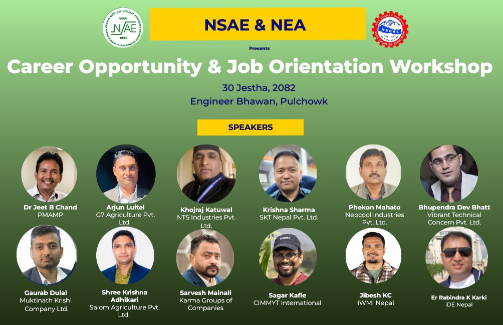

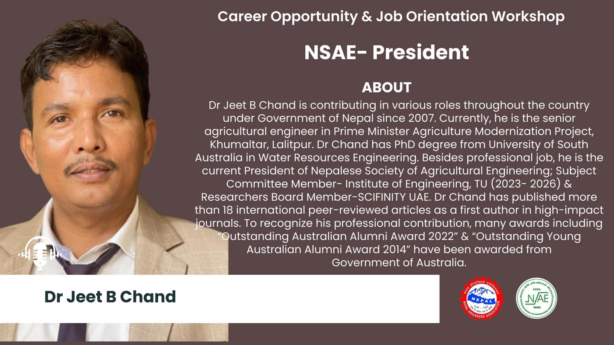
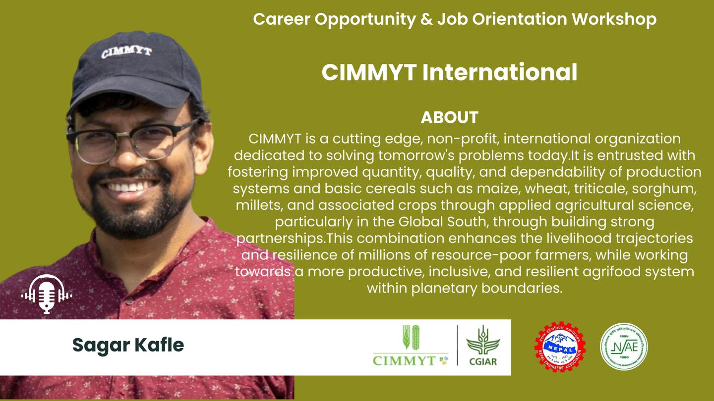

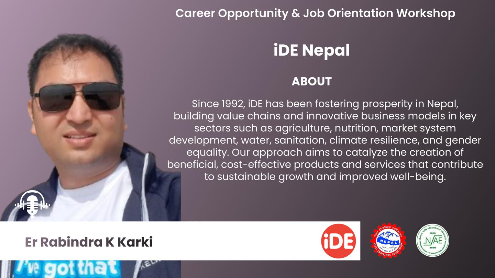
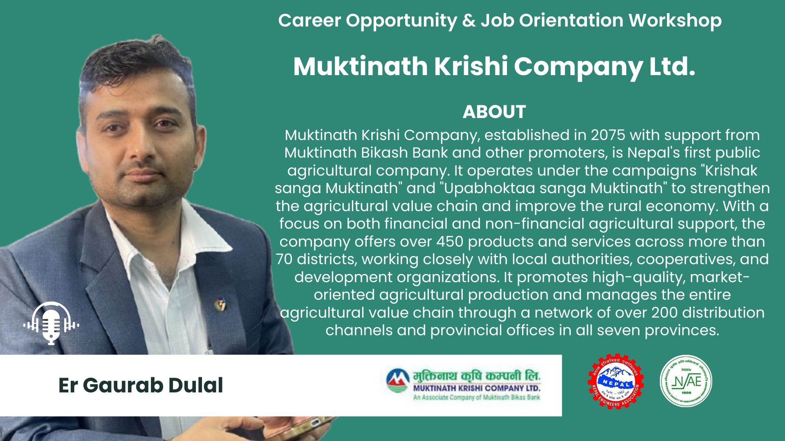
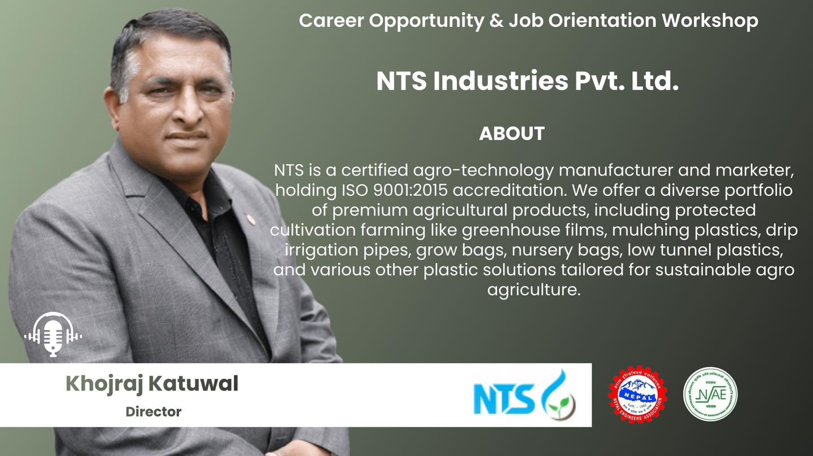
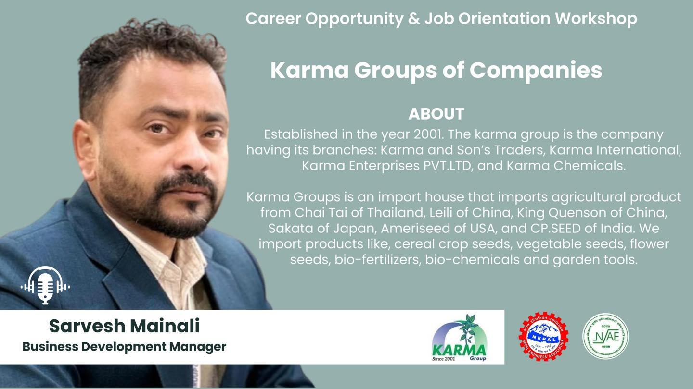
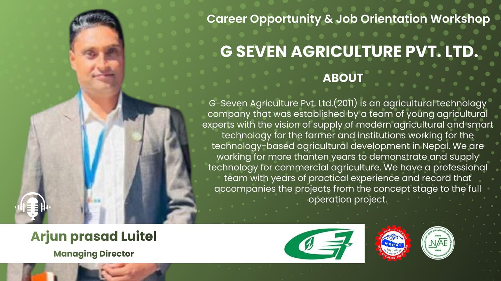
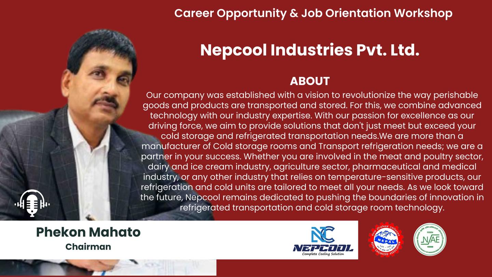
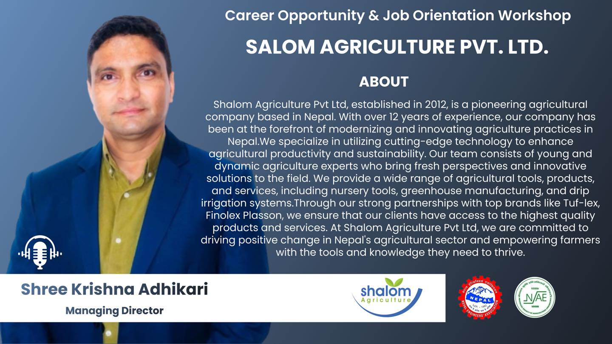
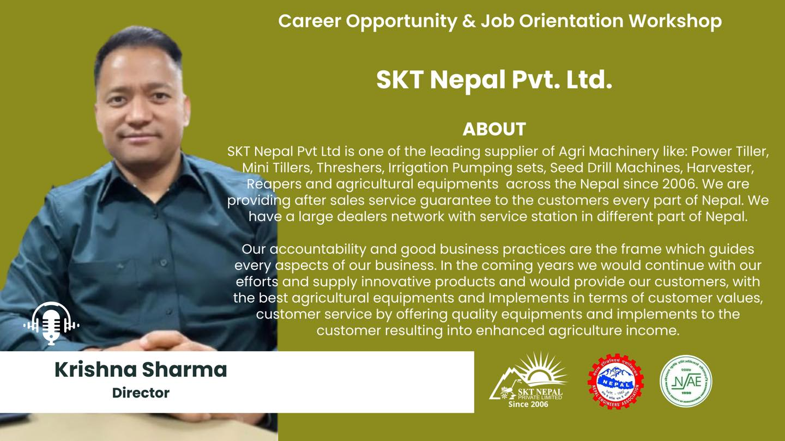
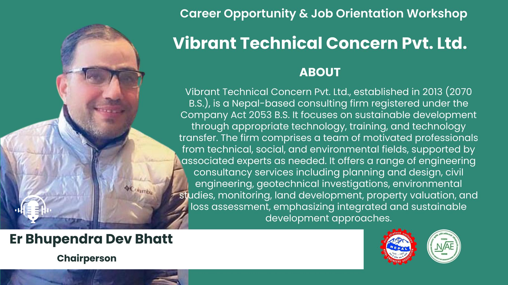